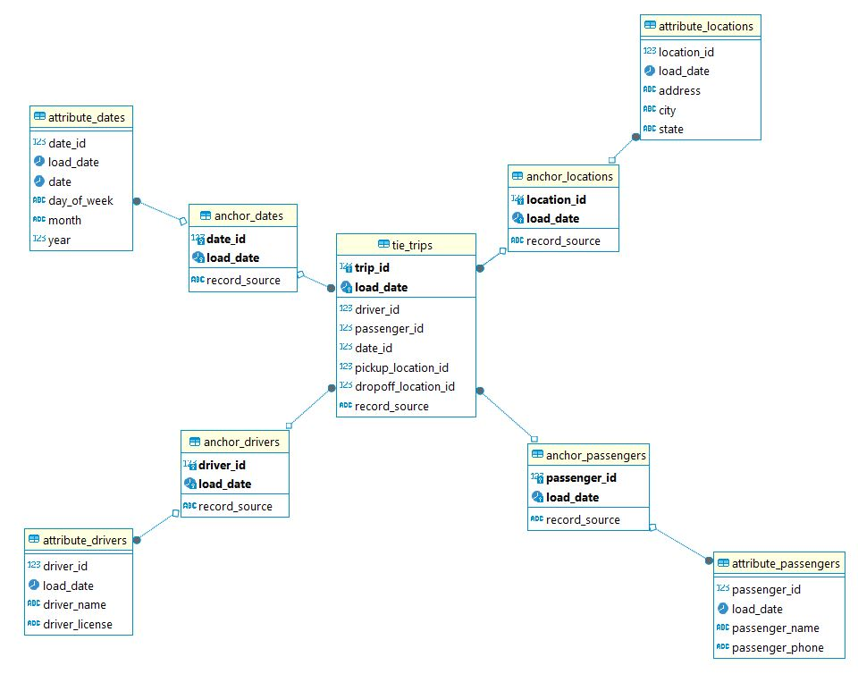

# model-anchor
Создание модели данных на основе якорного моделирования для анализа данных о поездках в такси

## Anchors (Якоря)
anchor_drivers – Якорь водителей <br>
anchor_passengers – Якорь пассажиров <br>
anchor_dates – Якорь дат <br>
anchor_locations – Якорь локаций <br>

## Attributes (Атрибуты)
attribute_drivers – Атрибут водителей
attribute_passengers – Атрибут пассажиров
attribute_dates – Атрибут дат
attribute_locations – Атрибут локаций

## Ties (Связи)
tie_trips – Связь поездок

## Поля

### anchor_drivers (Якорь водителей)
driver_id – Идентификатор водителя <br>
load_date – Дата загрузки <br>
record_source – Источник записи <br>

### anchor_passengers (Якорь пассажиров)
passenger_id – Идентификатор пассажира <br>
load_date – Дата загрузки <br>
record_source – Источник записи <br>

### anchor_dates (Якорь дат)
date_id – Идентификатор даты <br>
load_date – Дата загрузки <br>
record_source – Источник записи <br>

### anchor_locations (Якорь локаций)
location_id – Идентификатор локации <br>
load_date – Дата загрузки <br>
record_source – Источник записи <br>

### attribute_drivers (Атрибут водителей)
driver_id – Идентификатор водителя <br>
load_date – Дата загрузки <br>
driver_name – Имя водителя <br>
driver_license – Номер водительского удостоверения <br>

### attribute_passengers (Атрибут пассажиров)
passenger_id – Идентификатор пассажира <br>
load_date – Дата загрузки <br>
passenger_name – Имя пассажира <br>
passenger_phone – Телефон пассажира <br>

### attribute_dates (Атрибут дат)
date_id – Идентификатор даты <br>
load_date – Дата загрузки <br>
date – Дата <br>
day_of_week – День недели <br>
month – Месяц <br>
year – Год <br>

### attribute_locations (Атрибуты локаций)
location_id – Идентификатор локации <br>
load_date – Дата загрузки <br>
address – Адрес <br>
city – Город <br>
state – Штат/область <br>

### tie_trips (Связующие поездки)
trip_id – Идентификатор поездки <br>
driver_id – Идентификатор водителя <br>
passenger_id – Идентификатор пассажира <br>
date_id – Идентификатор даты <br>
pickup_location_id – Идентификатор места посадки <br>
dropoff_location_id – Идентификатор места высадки <br>
load_date – Дата загрузки <br>
record_source – Источник записи <br>

## Схема


## SQL-скрипт
```
CREATE SCHEMA IF NOT EXISTS anchor_modeling;

CREATE TABLE anchor_modeling.anchor_drivers (
    driver_id INT,
    load_date DATE,
    record_source VARCHAR(50),
    PRIMARY KEY (driver_id, load_date)
);

CREATE TABLE anchor_modeling.anchor_passengers (
    passenger_id INT,
    load_date DATE,
    record_source VARCHAR(50),
    PRIMARY KEY (passenger_id, load_date)
);

CREATE TABLE anchor_modeling.anchor_dates (
    date_id INT,
    load_date DATE,
    record_source VARCHAR(50),
    PRIMARY KEY (date_id, load_date)
);

CREATE TABLE anchor_modeling.anchor_locations (
    location_id INT,
    load_date DATE,
    record_source VARCHAR(50),
    PRIMARY KEY (location_id, load_date)
);

CREATE TABLE anchor_modeling.attribute_drivers (
    driver_id INT,
    load_date DATE,
    driver_name VARCHAR(100),
    driver_license VARCHAR(50),
    FOREIGN KEY (driver_id, load_date) REFERENCES anchor_modeling.anchor_drivers(driver_id, load_date)
);

CREATE TABLE anchor_modeling.attribute_passengers (
    passenger_id INT,
    load_date DATE,
    passenger_name VARCHAR(100),
    passenger_phone VARCHAR(20),
    FOREIGN KEY (passenger_id, load_date) REFERENCES anchor_modeling.anchor_passengers(passenger_id, load_date)
);

CREATE TABLE anchor_modeling.attribute_dates (
    date_id INT,
    load_date DATE,
    date DATE,
    day_of_week VARCHAR(10),
    month VARCHAR(10),
    year INT,
    FOREIGN KEY (date_id, load_date) REFERENCES anchor_modeling.anchor_dates(date_id, load_date)
);

CREATE TABLE anchor_modeling.attribute_locations (
    location_id INT,
    load_date DATE,
    address VARCHAR(255),
    city VARCHAR(100),
    state VARCHAR(100),
    FOREIGN KEY (location_id, load_date) REFERENCES anchor_modeling.anchor_locations(location_id, load_date)
);

CREATE TABLE anchor_modeling.tie_trips (
    trip_id INT,
    driver_id INT,
    passenger_id INT,
    date_id INT,
    pickup_location_id INT,
    dropoff_location_id INT,
    load_date DATE,
    record_source VARCHAR(50),
    PRIMARY KEY (trip_id, load_date),
    FOREIGN KEY (driver_id, load_date) REFERENCES anchor_modeling.anchor_drivers(driver_id, load_date),
    FOREIGN KEY (passenger_id, load_date) REFERENCES anchor_modeling.anchor_passengers(passenger_id, load_date),
    FOREIGN KEY (date_id, load_date) REFERENCES anchor_modeling.anchor_dates(date_id, load_date),
    FOREIGN KEY (pickup_location_id, load_date) REFERENCES anchor_modeling.anchor_locations(location_id, load_date),
    FOREIGN KEY (dropoff_location_id, load_date) REFERENCES anchor_modeling.anchor_locations(location_id, load_date)
);
```
